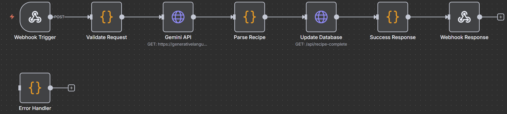

# n8n Workflow Documentation

## Workflow Overview

This document describes the n8n workflow used for asynchronous recipe generation in the Recipe Generator App. The workflow processes recipe generation requests through a series of automated steps, from receiving webhook requests to generating AI-powered recipes and updating the database.

## Workflow Visualization



## Workflow Architecture

The workflow consists of 8 interconnected nodes that handle the complete recipe generation process:

```
Webhook Trigger → Validate Request → Gemini API → Parse Recipe → Update Database → Success Response → Webhook Response
                                    ↓
                              Error Handler
```

## Node Details

### 1. Webhook Trigger
- **Node ID**: `e57fe527-0e9b-4b9b-89b3-29f4288e38e5`
- **Type**: Webhook
- **Path**: `recipe-generation`
- **HTTP Method**: POST
- **Purpose**: Entry point for recipe generation requests
- **Configuration**:
  - Response Mode: Response Node
  - Webhook ID: `recipe-generation`

**Expected Input**:
```json
{
  "recipeId": "unique-recipe-id",
  "prompt": "chicken, rice, vegetables",
  "email": "user@example.com",
  "userId": "optional-user-id"
}
```

### 2. Validate Request
- **Node ID**: `980d1af9-d781-47d6-acc0-89d4d7fc311a`
- **Type**: Code Node
- **Purpose**: Validates and processes incoming webhook data

**Functions**:
- Validates required fields (recipeId, prompt, email)
- Normalizes email address (lowercase, trim)
- Logs incoming requests for debugging
- Returns structured data for processing

**Code Logic**:
```javascript
// Validate and process incoming webhook data
const { recipeId, prompt, email, userId } = $input.all()[0].json;

// Validate required fields
if (!recipeId || !prompt || !email) {
  throw new Error('Missing required fields: recipeId, prompt, or email');
}

// Normalize email
const normalizedEmail = email.toLowerCase().trim();

// Log the incoming request
console.log(`Recipe generation request received for user: ${normalizedEmail}`);
console.log(`Recipe ID: ${recipeId}`);
console.log(`Prompt: ${prompt}`);

return {
  recipeId,
  prompt: prompt.trim(),
  email: normalizedEmail,
  userId,
  timestamp: new Date().toISOString()
};
```

### 3. Gemini API
- **Node ID**: `3ed1708c-ad5e-4c4b-8eeb-ab292dc01c68`
- **Type**: HTTP Request
- **Endpoint**: `https://generativelanguage.googleapis.com/v1beta/models/gemini-pro:generateContent`
- **Method**: POST
- **Purpose**: Generates recipes using Google's Gemini AI

**Request Headers**:
```
Content-Type: application/json
```

**Request Body**:
```json
{
  "key": "{{ $env.GEMINI_API_KEY }}",
  "contents": [{
    "parts": [{
      "text": "You are a professional chef and recipe creator. Create a detailed, step-by-step recipe from the given ingredients. The recipe should be practical, delicious, and include all necessary information.\n\nIngredients provided: {{ $json.prompt }}\n\nPlease create a recipe and return it in the following JSON format:\n\n{\n  \"title\": \"Recipe Title\",\n  \"instructions\": \"Step 1: ...\nStep 2: ...\nStep 3: ...\",\n  \"metadata\": {\n    \"cookingTime\": \"30-45 minutes\",\n    \"servings\": \"4 servings\",\n    \"difficulty\": \"Medium\",\n    \"cuisine\": \"International\",\n    \"prepTime\": \"15 minutes\",\n    \"totalTime\": \"45-60 minutes\",\n    \"calories\": \"350-450 kcal\",\n    \"tags\": [\"Quick\", \"Healthy\"],\n    \"ingredients\": [\"ingredient1\", \"ingredient2\"]\n  }\n}"
    }]
  }]
}
```

### 4. Parse Recipe
- **Node ID**: `9747259c-7f49-4d4b-a541-8bb2de81295d`
- **Type**: Code Node
- **Purpose**: Extracts and processes AI response

**Functions**:
- Parses JSON from Gemini API response
- Handles parsing errors with fallback recipe
- Combines with original request data
- Adds generation timestamp

**Code Logic**:
```javascript
// Parse Gemini API response and extract recipe data
const geminiResponse = $input.all()[0].json;

// Extract the generated text from Gemini response
const generatedText = geminiResponse.candidates[0].content.parts[0].text;

// Try to extract JSON from the response
let recipeData;
try {
  // Look for JSON in the response
  const jsonMatch = generatedText.match(/\{[\s\S]*\}/);
  if (jsonMatch) {
    recipeData = JSON.parse(jsonMatch[0]);
  } else {
    throw new Error('No JSON found in response');
  }
} catch (error) {
  console.error('Error parsing Gemini response:', error);
  
  // Fallback recipe if parsing fails
  recipeData = {
    title: "Simple Recipe from Your Ingredients",
    instructions: "1. Prepare your ingredients\n2. Follow basic cooking methods\n3. Season to taste",
    metadata: {
      cookingTime: "30 minutes",
      servings: "2-4 servings",
      difficulty: "Easy",
      cuisine: "General",
      prepTime: "10 minutes",
      totalTime: "40 minutes",
      calories: "300-400 kcal",
      tags: ["Simple", "Quick"],
      ingredients: $('Validate Request').item.json.prompt.split(',').map(item => item.trim())
    }
  };
}

// Combine with original request data
return {
  ...$('Validate Request').item.json,
  ...recipeData,
  generatedAt: new Date().toISOString()
};
```

### 5. Update Database
- **Node ID**: `9a2d4a85-55a4-4be2-911c-9803ad56b683`
- **Type**: HTTP Request
- **Endpoint**: `{{ $env.NEXTJS_APP_URL }}/api/recipe-complete`
- **Method**: POST
- **Purpose**: Saves generated recipe to database

**Request Headers**:
```
Content-Type: application/json
```

**Request Body**:
```json
{
  "recipeId": "{{ $json.recipeId }}",
  "status": "completed",
  "userEmail": "{{ $json.email }}",
  "metadata": {
    "title": "{{ $json.title }}",
    "instructions": "{{ $json.instructions }}",
    "cookingTime": "{{ $json.metadata.cookingTime }}",
    "servings": "{{ $json.metadata.servings }}",
    "difficulty": "{{ $json.metadata.difficulty }}",
    "cuisine": "{{ $json.metadata.cuisine }}",
    "prepTime": "{{ $json.metadata.prepTime }}",
    "totalTime": "{{ $json.metadata.totalTime }}",
    "calories": "{{ $json.metadata.calories }}",
    "tags": "{{ $json.metadata.tags }}",
    "ingredients": "{{ $json.metadata.ingredients }}"
  }
}
```

### 6. Success Response
- **Node ID**: `83bcc055-a46e-4e66-9a86-3127cbce4371`
- **Type**: Code Node
- **Purpose**: Prepares success response

**Functions**:
- Logs successful completion
- Formats response data
- Adds success indicators and timestamp

**Code Logic**:
```javascript
// Prepare success response
const recipeData = $('Parse Recipe').item.json;
const updateResult = $('Update Database').item.json;

console.log(`Recipe generation completed for user: ${recipeData.email}`);
console.log(`Recipe ID: ${recipeData.recipeId}`);
console.log(`Recipe Title: ${recipeData.title}`);

return {
  success: true,
  recipeId: recipeData.recipeId,
  email: recipeData.email,
  title: recipeData.title,
  message: 'Recipe generated and saved successfully',
  timestamp: new Date().toISOString()
};
```

### 7. Webhook Response
- **Node ID**: `5f6e6025-50a4-420f-87f9-2213daa2b4f5`
- **Type**: Respond to Webhook
- **Purpose**: Returns response to client
- **Response Format**: JSON

**Response Body**:
```json
{
  "success": true,
  "recipeId": "unique-recipe-id",
  "email": "user@example.com",
  "title": "Generated Recipe Title",
  "message": "Recipe generated and saved successfully",
  "timestamp": "2025-01-08T10:28:24.000Z"
}
```

### 8. Error Handler
- **Node ID**: `63f370ef-eeae-48e5-86cb-7cf6679f0b4d`
- **Type**: Code Node
- **Purpose**: Handles workflow errors

**Functions**:
- Logs errors for debugging
- Updates recipe status to failed
- Returns error response with details

**Code Logic**:
```javascript
// Error handling and logging
const error = $input.all()[0].json;

console.error('Workflow error:', error);

// Try to update recipe status to failed
const originalData = $('Validate Request').item.json;

try {
  await fetch(`${$env.NEXTJS_APP_URL}/api/recipe-complete`, {
    method: 'POST',
    headers: { 'Content-Type': 'application/json' },
    body: JSON.stringify({
      recipeId: originalData.recipeId,
      status: 'failed',
      userEmail: originalData.email,
      metadata: { error: error.message }
    })
  });
} catch (updateError) {
  console.error('Failed to update recipe status:', updateError);
}

return {
  success: false,
  error: error.message,
  recipeId: originalData.recipeId,
  email: originalData.email,
  timestamp: new Date().toISOString()
};
```

## Environment Variables

The workflow requires the following environment variables to be configured in n8n:

| Variable | Description | Example |
|----------|-------------|---------|
| `GEMINI_API_KEY` | Google Gemini API key for AI recipe generation | `AIzaSyC...` |
| `NEXTJS_APP_URL` | URL of your Next.js application | `https://your-app.vercel.app` |

## Workflow Configuration

### Import Instructions

1. **Open n8n**: Access your n8n instance
2. **Import Workflow**: 
   - Click "Import from file"
   - Select `public/n8n workflow.json`
   - Review the imported workflow
3. **Configure Environment Variables**:
   - Set `GEMINI_API_KEY` with your Google Gemini API key
   - Set `NEXTJS_APP_URL` with your application URL
4. **Activate Workflow**: Click "Activate" to start the workflow

### Webhook URL

After activation, n8n will provide a webhook URL similar to:
```
https://your-n8n-instance.com/webhook/recipe-generation
```

This URL should be configured in your Next.js application as the `N8N_WEBHOOK_URL` environment variable.

## API Integration

### Request Format

To trigger recipe generation, send a POST request to the webhook URL:

```bash
curl -X POST https://your-n8n-instance.com/webhook/recipe-generation \
  -H "Content-Type: application/json" \
  -d '{
    "recipeId": "recipe-123",
    "prompt": "chicken, rice, vegetables",
    "email": "user@example.com",
    "userId": "user-456"
  }'
```

### Response Format

**Success Response**:
```json
{
  "success": true,
  "recipeId": "recipe-123",
  "email": "user@example.com",
  "title": "Chicken Rice Bowl",
  "message": "Recipe generated and saved successfully",
  "timestamp": "2025-01-08T10:28:24.000Z"
}
```

**Error Response**:
```json
{
  "success": false,
  "error": "Missing required fields: recipeId, prompt, or email",
  "recipeId": "recipe-123",
  "email": "user@example.com",
  "timestamp": "2025-01-08T10:28:24.000Z"
}
```

## Error Handling

The workflow includes comprehensive error handling:

1. **Input Validation**: Validates required fields before processing
2. **API Error Handling**: Handles Gemini API failures gracefully
3. **JSON Parsing**: Fallback recipe if AI response parsing fails
4. **Database Update Errors**: Logs database update failures
5. **Workflow Errors**: Catches and logs all workflow errors

## Monitoring and Logging

The workflow includes extensive logging for monitoring:

- **Request Logging**: Logs all incoming requests with user details
- **Processing Logs**: Tracks each step of the workflow
- **Error Logging**: Detailed error messages for debugging
- **Completion Logs**: Confirms successful recipe generation

## Performance Considerations

- **Asynchronous Processing**: Recipe generation happens in the background
- **Timeout Handling**: Configure appropriate timeouts for API calls
- **Rate Limiting**: Respect Gemini API rate limits
- **Error Recovery**: Automatic retry mechanisms for transient failures

## Security

- **Input Validation**: Validates all incoming data
- **API Key Protection**: Uses environment variables for sensitive data
- **Error Sanitization**: Prevents sensitive information in error responses
- **Webhook Security**: Validate webhook signatures if required

## Troubleshooting

### Common Issues

1. **Missing Environment Variables**:
   - Ensure `GEMINI_API_KEY` and `NEXTJS_APP_URL` are set
   - Check n8n environment variable configuration

2. **Webhook Not Responding**:
   - Verify workflow is activated
   - Check webhook URL is correct
   - Review n8n logs for errors

3. **Recipe Generation Fails**:
   - Check Gemini API key validity
   - Verify API quota and rate limits
   - Review error logs for specific issues

4. **Database Update Fails**:
   - Verify `NEXTJS_APP_URL` is correct
   - Check API endpoint availability
   - Review database connection

### Debug Steps

1. **Check n8n Execution Logs**:
   - View workflow execution history
   - Review node-specific logs
   - Check for error messages

2. **Test Individual Nodes**:
   - Test webhook manually
   - Verify API connections
   - Check data flow between nodes

3. **Monitor API Responses**:
   - Check Gemini API response format
   - Verify database update responses
   - Review webhook response data

## Support

For issues with this workflow:

1. Check the n8n execution logs
2. Verify environment variable configuration
3. Test API endpoints manually
4. Review the main application logs
5. Check n8n and Gemini API documentation 