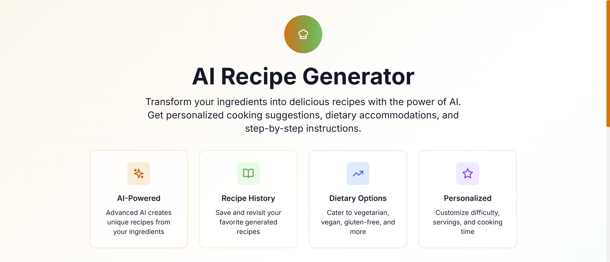
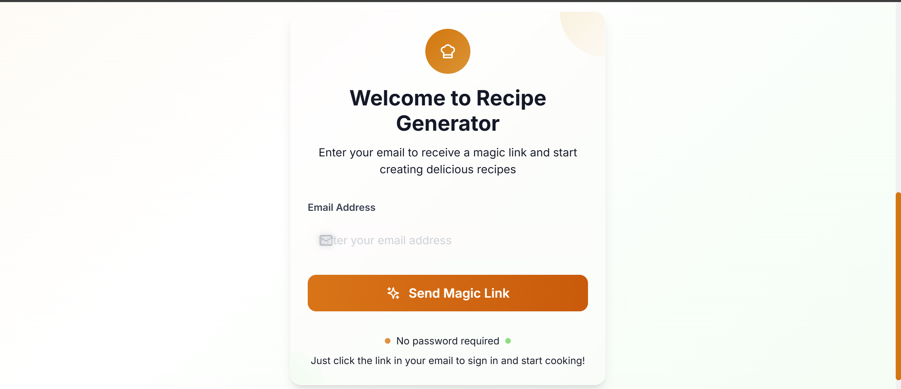
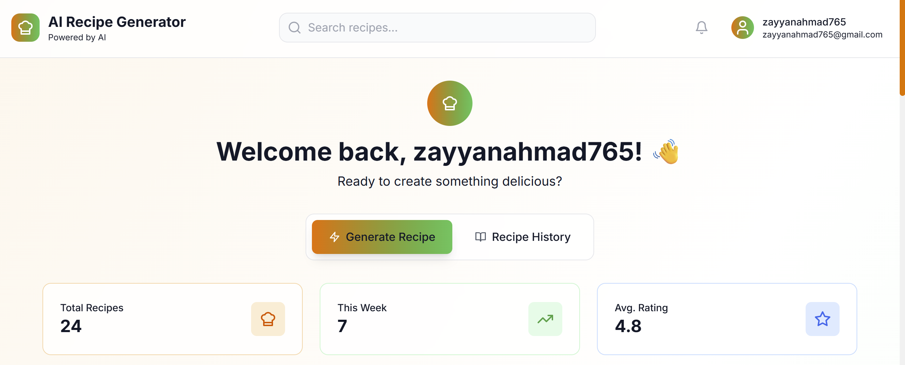
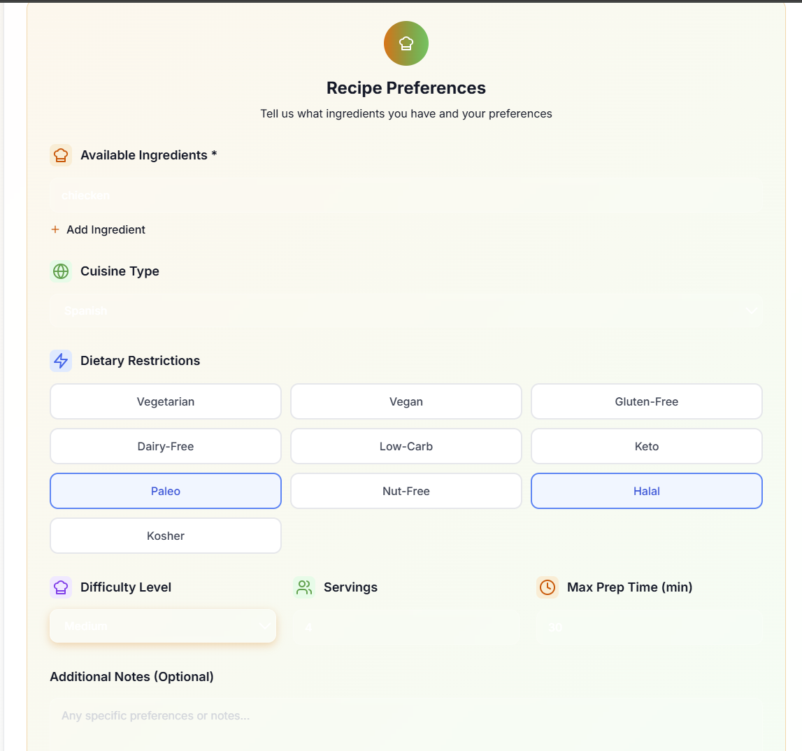
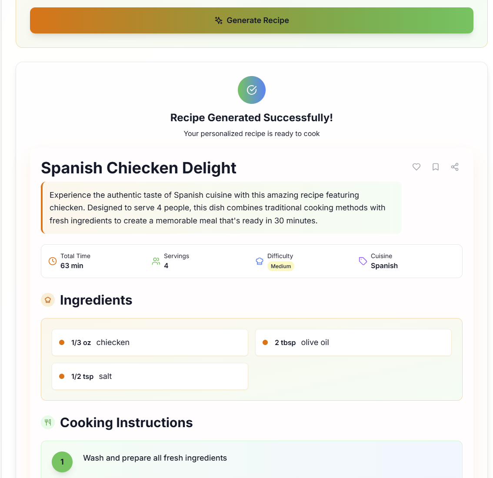

# Recipe Generator App

> **📖 Detailed Documentation For n8n**: For comprehensive n8n workflow documentation, including node-by-node breakdown, API integration details, and troubleshooting guides, see [N8N_WORKFLOW_README.md](./N8N_WORKFLOW_README.md)

## Application Screenshots

### Main Interface










## Overview

A Next.js application that generates recipes using AI (Gemini API) with an n8n workflow for asynchronous recipe generation. The app allows users to input ingredients and receive detailed, step-by-step recipes.

## Features

- **AI-Powered Recipe Generation**: Uses Google's Gemini API to create detailed recipes
- **Asynchronous Processing**: n8n workflow handles recipe generation in the background
- **User Authentication**: Supabase integration for user management
- **Recipe History**: Track and view previously generated recipes
- **Real-time Updates**: Webhook-based status updates
- **Modern UI**: Built with Tailwind CSS and React components

## Tech Stack

- **Frontend**: Next.js 14, React, TypeScript, Tailwind CSS
- **Backend**: Next.js API Routes, Supabase
- **AI**: Google Gemini API
- **Workflow Automation**: n8n
- **Database**: Supabase (PostgreSQL)
- **Authentication**: Supabase Auth

## Project Structure

```
final project/
├── ai/                          # AI-related configurations
├── app/                         # Next.js app directory
│   ├── api/                     # API routes
│   │   ├── health/              # Health check endpoint
│   │   ├── recipes/             # Recipe-related endpoints
│   │   │   ├── generate/        # Recipe generation endpoint
│   │   │   ├── history/         # Recipe history endpoint
│   │   │   └── history-simple/  # Simplified history endpoint
│   │   ├── route.ts             # Main API route
│   │   └── test-supabase/       # Supabase testing endpoint
│   ├── auth/                    # Authentication pages
│   │   └── callback/            # Auth callback handling
│   ├── globals.css              # Global styles
│   ├── layout.tsx               # Root layout
│   ├── loading.tsx              # Loading component
│   ├── not-found.tsx            # 404 page
│   └── page.tsx                 # Home page
├── components/                  # React components
│   ├── auth/                    # Authentication components
│   │   └── AuthForm.tsx         # Login/signup form
│   ├── layout/                  # Layout components
│   │   └── Header.tsx           # Navigation header
│   ├── providers/               # Context providers
│   │   └── SupabaseProvider.tsx # Supabase context
│   ├── recipe/                  # Recipe-related components
│   │   ├── RecipeDisplay.tsx    # Recipe display component
│   │   ├── RecipeForm.tsx       # Recipe input form
│   │   ├── RecipeGenerator.tsx  # Main recipe generator
│   │   └── RecipeHistory.tsx    # Recipe history display
│   └── ui/                      # UI components
│       ├── ErrorBoundary.tsx    # Error handling
│       ├── LoadingSpinner.tsx   # Loading indicator
│       └── Skeleton.tsx         # Loading skeleton
├── lib/                         # Utility libraries
│   ├── mongodb.ts               # MongoDB configuration
│   ├── supabase.ts              # Supabase client
│   └── utils.ts                 # Utility functions
├── types/                       # TypeScript type definitions
│   ├── api.ts                   # API-related types
│   └── recipe.ts                # Recipe-related types
├── public/                      # Static assets
│   ├── n8n workflow.json        # n8n workflow configuration
│   └── Screen Recording 2025-08-01 102824.mp4  # Demo video
├── middleware.ts                # Next.js middleware
├── next.config.js               # Next.js configuration
├── package.json                 # Dependencies and scripts
├── tailwind.config.js           # Tailwind CSS configuration
├── tsconfig.json                # TypeScript configuration
└── vercel.json                  # Vercel deployment configuration
```

## n8n Workflow Documentation

The application uses an n8n workflow for asynchronous recipe generation. The workflow is defined in `public/n8n workflow.json` and consists of the following nodes:

### Workflow Overview

The workflow processes recipe generation requests through the following steps:

1. **Webhook Trigger** - Receives recipe generation requests
2. **Validate Request** - Validates and processes incoming data
3. **Gemini API** - Calls Google's Gemini API for recipe generation
4. **Parse Recipe** - Extracts and formats recipe data from AI response
5. **Update Database** - Saves the generated recipe to the database
6. **Success Response** - Prepares success response
7. **Webhook Response** - Returns response to the client
8. **Error Handler** - Handles errors and updates recipe status

### Node Details

#### 1. Webhook Trigger
- **Type**: Webhook
- **Path**: `recipe-generation`
- **Method**: POST
- **Purpose**: Entry point for recipe generation requests

#### 2. Validate Request
- **Type**: Code Node
- **Purpose**: Validates required fields (recipeId, prompt, email)
- **Functions**:
  - Validates input data
  - Normalizes email address
  - Logs incoming requests
  - Returns structured data

#### 3. Gemini API
- **Type**: HTTP Request
- **Endpoint**: `https://generativelanguage.googleapis.com/v1beta/models/gemini-pro:generateContent`
- **Purpose**: Generates recipes using Google's Gemini AI
- **Request Format**: JSON with ingredients prompt
- **Response**: AI-generated recipe in JSON format

#### 4. Parse Recipe
- **Type**: Code Node
- **Purpose**: Extracts and processes AI response
- **Functions**:
  - Parses JSON from AI response
  - Handles parsing errors with fallback
  - Combines with original request data
  - Adds timestamp

#### 5. Update Database
- **Type**: HTTP Request
- **Endpoint**: `{{ $env.NEXTJS_APP_URL }}/api/recipe-complete`
- **Purpose**: Saves generated recipe to database
- **Data**: Recipe metadata, status, and user information

#### 6. Success Response
- **Type**: Code Node
- **Purpose**: Prepares success response
- **Functions**:
  - Logs completion
  - Formats response data
  - Adds success indicators

#### 7. Webhook Response
- **Type**: Respond to Webhook
- **Purpose**: Returns response to client
- **Format**: JSON response

#### 8. Error Handler
- **Type**: Code Node
- **Purpose**: Handles workflow errors
- **Functions**:
  - Logs errors
  - Updates recipe status to failed
  - Returns error response

### Environment Variables Required

The workflow requires the following environment variables:

- `GEMINI_API_KEY`: Google Gemini API key
- `NEXTJS_APP_URL`: URL of your Next.js application

### API Endpoints

The workflow interacts with these API endpoints:

- **POST** `/api/recipe-complete` - Updates recipe status and saves metadata

## Installation

1. Clone the repository:
```bash
git clone <repository-url>
cd final-project
```

2. Install dependencies:
```bash
npm install
```

3. Set up environment variables:
```bash
cp env.example .env.local
```

4. Configure the following environment variables:
```env
NEXT_PUBLIC_SUPABASE_URL=your_supabase_url
NEXT_PUBLIC_SUPABASE_ANON_KEY=your_supabase_anon_key
GEMINI_API_KEY=your_gemini_api_key
N8N_WEBHOOK_URL=your_n8n_webhook_url
```

5. Set up Supabase:
   - Create a new Supabase project
   - Set up authentication
   - Create necessary database tables

6. Import the n8n workflow:
   - Open n8n
   - Import the workflow from `public/n8n workflow.json`
   - Configure environment variables
   - Activate the workflow

7. Run the development server:
```bash
npm run dev
```

## Usage

1. **Authentication**: Users can sign up or log in using Supabase authentication
2. **Recipe Generation**: 
   - Enter ingredients in the recipe form
   - Submit to generate a recipe
   - The request is sent to n8n workflow for processing
   - Recipe is generated using Gemini AI
   - Results are saved and displayed to the user
3. **Recipe History**: View previously generated recipes
4. **Real-time Updates**: Recipe status updates in real-time

## API Endpoints

### Recipe Generation
- **POST** `/api/recipes/generate` - Initiates recipe generation
- **GET** `/api/recipes/history` - Retrieves recipe history
- **POST** `/api/recipe-complete` - Updates recipe status (called by n8n)

### Authentication
- **GET** `/auth/callback` - Handles authentication callbacks

## Deployment

The application is configured for deployment on Vercel:

1. Connect your repository to Vercel
2. Configure environment variables in Vercel dashboard
3. Deploy the application
4. Update n8n webhook URLs to point to production

## Contributing

1. Fork the repository
2. Create a feature branch
3. Make your changes
4. Test thoroughly
5. Submit a pull request

## 📝 License & Legal

### 📄 License
This project is created for **educational and demonstration purposes** as part of the Nexium Internship Assignment.

### 🔒 Terms of Use
- **Educational Purpose**: This project is designed for learning and demonstration
- **Ethical Usage**: All web scraping follows ethical guidelines
- **No Commercial Use**: Not intended for commercial applications
- **Attribution**: Please credit the original author when using this code

---

**Note**: This project demonstrates modern web development practices with ethical data collection. The AI summaries and translations are predefined for demonstration purposes, ensuring res
